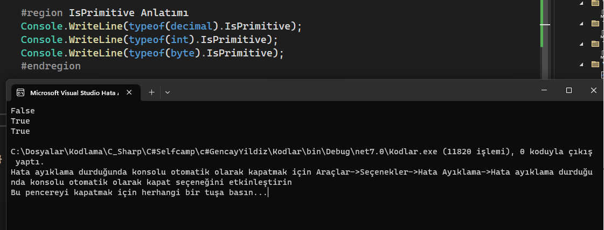
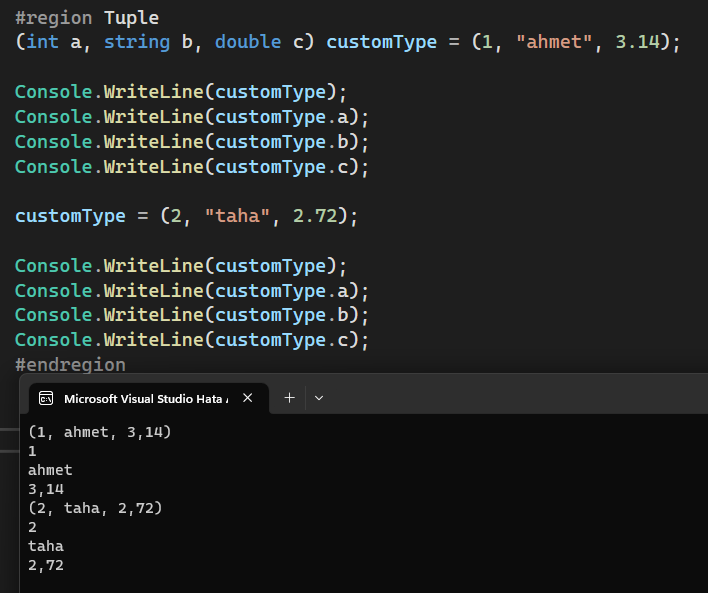
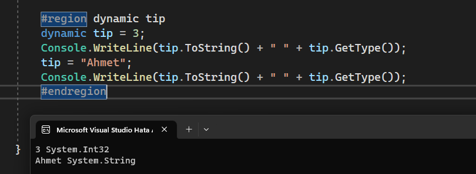

# Deðiþkenler

- [IsPrimitive](###isprimitive)
- [Deðiþkenlerin Açýklamasý](###degiskenlerin-aciklamasi)
- [Tuple](###tuple)
- [var ve dynamic keyword'leri](###var-ve-dynamic)
- [Tur Dönüsümü](###tur-donusumu)


### IsPrimitive

Saf tür mü? demektir. Saf tür derken ise eðer baþka tiplerden oluþturuluyorsa bu tip `primitive`
deðil demektir. Örneðin decimal arkada intlerden oluþturulmakta olduðu için false cevabýný döner.
[Peki Ne iþimize yarar.](./BilememKardeþ.md)

<pre><code class='language-cs'>public void Main()
{
	Console.WriteLine(typeof(decimal).IsPrimitive);
	Console.WriteLine(typeof(int).IsPrimitive);
	Console.WriteLine(typeof(byte).IsPrimitive);
}</code></pre>


### Degiskenlerin Aciklamasi

| Tür     | Açýklama | Aralýk
| ---      | ---       |
| Bool     | Doðru veya Yanlýþ. Olmak veya olmamak hepsi bu |0-1 (True- False)|
| char     | karakter tutar | 16 bit Unicode |
| sbyte    | Pozitif veya negatif aralýkta kýsa sayý tutar | -128 - 127 |
| byte     | sadece pozitif tam sayý | 0 - 255 |
| short    | Pozitif veya negatif olarak 16 bit tutar | -32_768 - 32767 arasý|
| ushort   | sadece pozitif olarak 16 bit tutar  | 0 - 65_535 arasý |
| int      | Pozitif veya negatif 32 bit tutar | -2_147_483_648 - 2_147_483_647 arasý  |
| uint     | sadece pozitif 32 bit tutar | 0 - 4_294_967_295 |
| long     | Pozitif veya negatif 64 bit sayý| -9_223_372_036_854_775_808 ile 9_223_372_036_854_775_807 arasý |
| ulong    | sadece pozitif 64 bit tutar | 0 ile 18_446_744_073_709_551_615 arasý |
| float    | virgüllü sayý tutar | [Aralýk Ýçin Buraya git](https://learn.microsoft.com/tr-tr/dotnet/csharp/language-reference/builtin-types/floating-point-numeric-types) |
| double   | daha geniþ virgüllü sayý tutar        | [Aralýk Ýçin Buraya git](https://learn.microsoft.com/tr-tr/dotnet/csharp/language-reference/builtin-types/floating-point-numeric-types) |
| decimal  | ondalýk sayý 128 bit | [Aralýk Ýçin Buraya git](https://learn.microsoft.com/tr-tr/dotnet/csharp/language-reference/builtin-types/floating-point-numeric-types) |

Kiþisel Not: Bunlarýn bu kadar çok olma sebebi performansta önemli olmasý olabilidðince ihtiyacýmýz olaný kullanmak lazým.

### Tuple

içine ayný anda birden fazla obje alan bir türdür. Buradaki int veya
stringleri kendi sýnýflarýnýzla da deðiþtirebilirsiniz.

<pre><code class='language-cs'>public void Main()
{
        (int a, string b, double c) customType = (1, "ahmet", 3.14);
        
        Console.WriteLine(customType);
        Console.WriteLine(customType.a);
        Console.WriteLine(customType.b);
        Console.WriteLine(customType.c);

        customType = (2, "taha", 2.72);

        Console.WriteLine(customType);
        Console.WriteLine(customType.a);
        Console.WriteLine(customType.b);
        Console.WriteLine(customType.c);
}</code></pre>




### var ve dynamic

`var` deðeri geliþtirme aþamasýnda alýr. `dynamic` ise derleme sýrasýnda tipi alýr.

`dynamic` ile tanýmlanan bir deðiþkende tip deðiþimi mümkündür. 

<pre><code class='language-cs'>public void Main()
{
    dynamic tip = 3;
    Console.WriteLine(tip.ToString() + " " + tip.GetType());
    tip = "Ahmet";
    Console.WriteLine(tip.ToString() + " " + tip.GetType());
}</code></pre>



* Türü bilinmeyen uzak verileri karþýlamada kullanýlabilir.


### Tur Donusumu

`bilinçsiz dönüþüm` = ``` byte a = 10; short veri = a;``` -> bilinçsiz dönüþümdür derleyici otomatik yapar
`bilinçli dönüþüm` = ``` short a = 10000; byte veri = (byte)a;``` -> bilinçli dönüþümde burada siz belirtmedikçe dönüþtürmez. Sizin `bilinçli` olarak yazmanýz lazým.

`check` = bilinçli dönüþümde veri kaybý varsa hata fýrlatýlmasýný saðlar
`uncheck` = bilinçli dönüþüm sýrasýnda veri kaybý varsa önemsemeden devam et demek

`is` -> `is` ile tip kontrolü yapýlabilir. x `is` bool gibi true ise bool'dur


