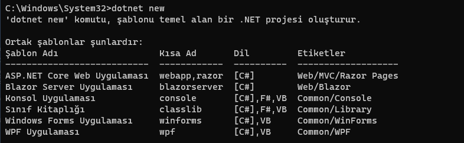

# DotNet CLI
### Bunun yerine VS kullanmak daha mantıklı
`Dotnet [komutlar]` şeklinde kullanılır. Yani Dotnet ile başlamak zorunda

`dotnet help` -> komut listesi

`dotnet new` yazarak şablon listesini alabilirsiniz.

`dotnet new [proje tipi] --name [proje adı]` -> proje oluşurma komutu

`dotnet new [proje tipi] --name [proje adı] --force` -> proje oluşurma komutu. Eğer proje önceden varsa üzerine yazar.

`dotnet restore` -> proje kapsamındaki araçları veya kütüphaneleri geri yükler. (?)

`dotnet build` -> .exe ve .dll çıktıları verir. Öncesinde restore işlemi yapar.

`dotnet publish` -> yayınlama işlemi (?)

`dotnet run` -> projeyi çalıştırır.

`dotnet run --no-build` -> uygulamayı derlemeden son derlenmiş hali ile çalıştırır

`dotnet add package` -> nuget paket yüklemesi sağlar.

`dotnet add reference` -> proje referansı eklemeyi sağlar

`dotnet remove package` ->  paket kaldırmayı sağlar

`dotnet remove reference` -> referans kaldırmayı sağlar

`dotnet list reference` -> referansları listeler

