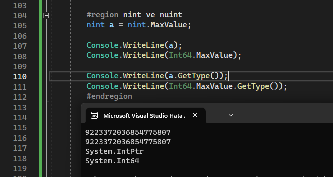

# Genel Konular

* [`Async Main` Yöntemin](#async-main)
* [Aramalarda `Tupple` ile Çoklu Seçenekler](#tupple)
* [Baþlangýç ve Bitiþ Olan Ýþlemleri Kolaylaþtýran `Range` Tipi](#range)
* [Partiallar](#partial)
* [Native Int](#nint)
* [Paragraf String](#paragraf-string)
* [Span ve memory](#span-ve-memory)
* [Regular Expressions](#regular-expressions)<br>
&nbsp; &nbsp; &nbsp; &nbsp; > [^ Operatörü](#regular-expressions)<br>
&nbsp; &nbsp; &nbsp; &nbsp; > [\\ Operatörü](#regular-expressions)<br>
&nbsp; &nbsp; &nbsp; &nbsp; > [+ Operatörü](#regular-expressions)<br>
&nbsp; &nbsp; &nbsp; &nbsp; > [| Operatörü](#regular-expressions)<br>
&nbsp; &nbsp; &nbsp; &nbsp; > [\{ n \} Operatoru](#regular-expressions)<br>
&nbsp; &nbsp; &nbsp; &nbsp; > [? Operatörü](#regular-expressions)<br>


### Async Main

```
static void Main()
static void Main(string[])
static int Main()
static int Main(string[])
```
Test etmedim ama [Buradan](https://github.com/dotnet/csharplang/blob/main/proposals/csharp-7.1/async-main.md#detailed-design) Okuduðuma göre `main` methodu `C#7.1`'den beri Async olarak aþaðýdaki gibi kullanýlabilmekteymiþ.
```
static Task Main()
static Task<int> Main()
static Task Main(string[])
static Task<int> Main(string[])
```


### Tupple

[Burada](https://github.com/dotnet/csharplang/blob/main/proposals/csharp-7.1/infer-tuple-names.md#infer-tuple-names-aka-tuple-projection-initializers) yazýlana göre ve orada verdiði koda göre siz arama yaparken tek deðiþkene zorunlu demeyeylim ama genel olarak mecbur kalmanýzý çözmekte.
<br>
```
// "c" and "result" have element names "f1" and "f2"
var result = list.Select(c => (c.f1, c.f2)).Where(t => t.f2 == 1); 
```

örnek kodda görüldüðü gibi sadece iki veri için çekme yapýlmakta. Bu sayede DTO sistemi deðiþir.


### Range

Ben bunu çok sevdim. [Ýlk Geliþini okumak için týklayýn](https://github.com/dotnet/csharplang/blob/main/proposals/csharp-8.0/ranges.cs) Burada gösterildiðinin yanýnda artýk `Range` tipine 0 dan 100 e göndermek `0..100` ile ifade edilir bu çok kolay ve biraz `Python`'ca olmuþ :D


### Partial

[Buradan](https://github.com/dotnet/csharplang/blob/main/proposals/csharp-9.0/extending-partial-methods.md) bakarsanýz `partial` sadece sýnýfý deðil methodlarýda kapsar ve bu sayede artýk kimin eli kimin cebinde bilemezsiniz.

### Nint

[Buradan](https://github.com/dotnet/csharplang/blob/main/proposals/csharp-9.0/native-integers.md) bkarasanýz aslýnda çok maliyetli olduðunu göreceksiniz.
<br>
`Native` olmasýndan dolayý doanýma göre þekillenmesi çok iyi fakat resimdende göreceðiniz gibi bende 64 bit olarak çalýþýyor bunun yerine 64 bit kullansam daha iyi ki o kadar büyük sayýlara ihtiyacým yok.



### Paragraf String

[Buradan](https://github.com/dotnet/csharplang/blob/main/proposals/csharp-11.0/raw-string-literal.md) anlatýma gidebilirsiinz.<br>
Normalde hatýrladýðým kadarý ile çok satýrlý `string` yoktu `C#11` de gelen özelliklerde gördüm þimdi ve güzel gelmiþ.
`""" paragraflar """` þeklinde kulanýmý var. Ayrýca baþýna `$$` koyarakta içeride de `{{value}}` ile veri tipini gömebilirsiniz.


Biraz önce öðrendim ki bu iþlemi `@` ile de yapabiliyormuþuz. Yani siz<br>
```
string paragraf = @"
asd
asd
asd
asd
";
```
þeklinde çok satýrlý string yapabiliyormuþsunuz.

```
Console.WriteLine(@$"
{a}
{b}
{c}
");
```
bu þekilde de deðiþkenleri gömebilirsiniz.


### Span ve Memory
Bunlarýn maliyeti yüksek terimler.<br>
`Span` ramde istenilen yeri tutmayý saðlar. `ReadOnlySpan` ise ramde istenilen yeri okumayý saðlar. `Span` `ref struct` oalrak tasarlanmýþ bir `struct`'týr. `Memory` `span`'ýn daha serbest türüdür.   


### Regular Expressions

[Regex için Týkla](https://learn.microsoft.com/en-us/dotnet/api/system.text.regularexpressions.regex?view=net-7.0)<br>
[geeksforgeeks](https://www.geeksforgeeks.org/what-is-regular-expression-in-c-sharp/)<br>
En kýsa yol ise ChatGPT'ye yazdýrmak :D
#### ^ Operatoru

Satýr baþýnýn istenilen ifadede baþlanmasýný saðlar.<br>

`^9` => Ýstenilen metin `9` ile baþlamak **zorundadýr**. <br>

#### \ Operatoru

Belirli Karakter gruplarýný içermesini istersek kullanýrýz.<br>


`\D` => Rakam olmayan demek.<br>
`\d` => Rakam demek.<br>
`\W` => Alfanumeric olmamasý demek.<br>
`\w` => alfanumeric olmasý demek.<br>
`\S` => Boluk olmamasý gerektiðini belirtir.<br>
`\s` => Boþluk olmasý gerektiðini belirtir.<br>
<hr>
`\B` => Kelimenin baþýnda yada sonunda olmamasý gerekenler belirtilir.<br>
`\b` => Kelime belirtilen karakter dizisi ile sonlanýr.<br>

#### + Operatoru

Belirli gruptaki karakterlerden bir yada daha fazla olmasýný istiyorsan kullanýrsýýn.
<br>

`^9\d+\s` => 9 ile baþlayan arada herhangi bir sayý olan son karakteri boþluk olmayan demek.<br>

#### | Operatoru

birden fazla karakter grubundan bir yada bir kaçýnýn ilgili yerde olabileceðini belirtmek istiyorsan kullanýrýz<br>

`a|b|c` => baþ harfi a yada b yada c olan

#### \{ n \} Operatoru

sabit sayýda karakterin olmasý isteniyorsa `{adet}` þeklinde verilmeli<br>

Telefon numaramýz olsun. Kontrol için `regex` yazmak istedik diyelim.<br>
`\d\d\d-\d\d\d-\d\d-\d\d` => bunun gibi xxx-xxx-xx-xx formatý yerine Tekrar olduðu için<br>
`\d{3}-\d{3}-\d{2}-\d{2}` => uzunluk ayný olabilir ama daha rahat anlaþýlýr oldu.<br>

#### ? Operatoru

Önüne geldiði karakterin en az sýfýr en fazla bir kere olmasýný belirtir.<br>
`B?A` => burada içinde bir kere yada hiç `B` olan ve `A` ile biten kelime demek<br>

#### [n] Operatoru

aralýk belirtir. örneðin<br>
`[a-e]` => a-e arasýnda harfler olmalý demek<br>
`[1-5]` => 1-5 arasý sayýlar demek


