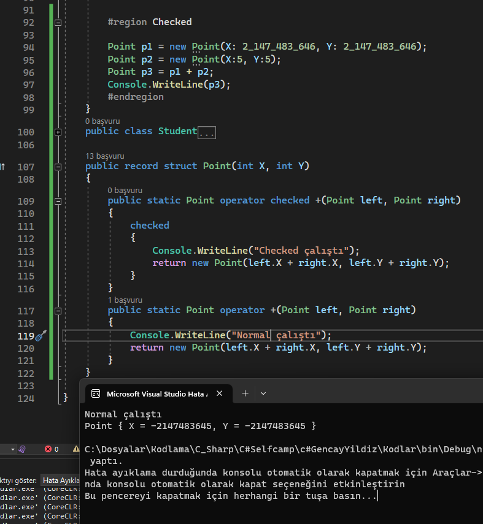
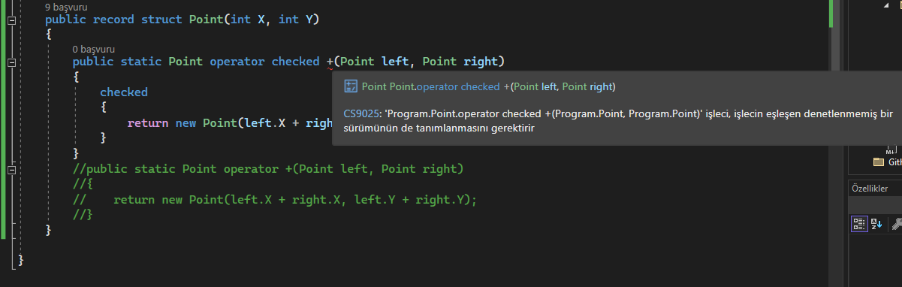
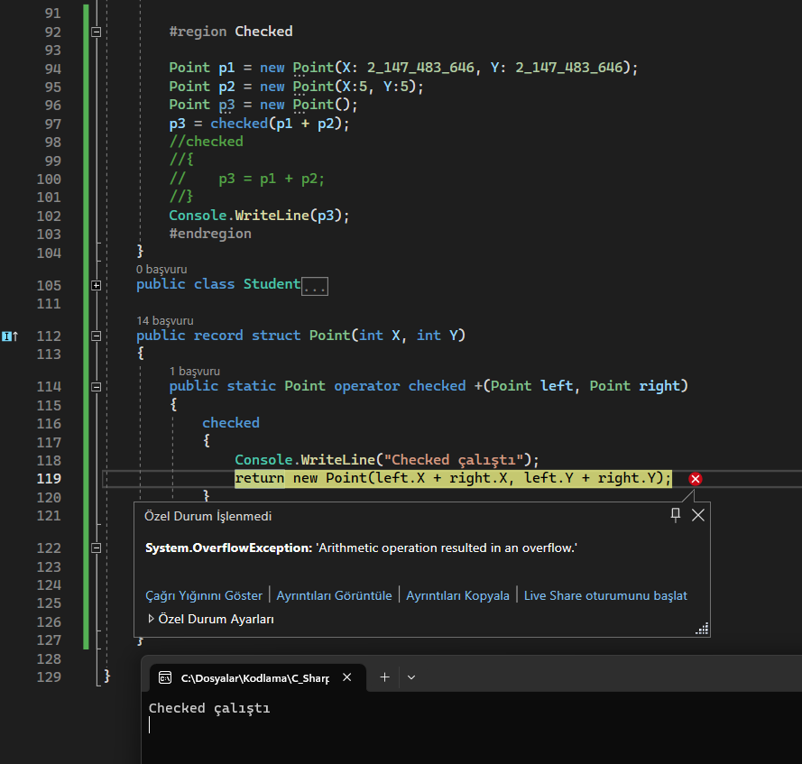
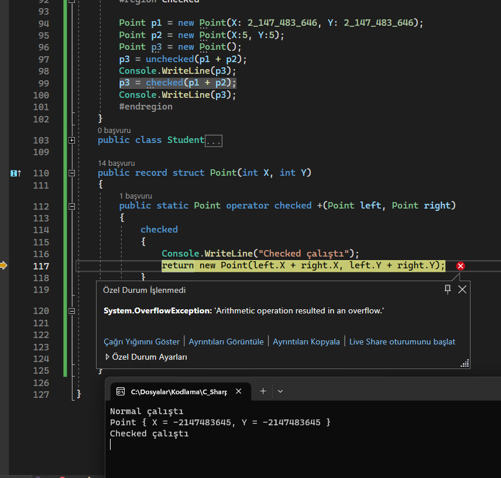

# Keywordler

[Tüm Keywordler için týklayýn.](https://learn.microsoft.com/tr-tr/dotnet/csharp/language-reference/keywords/)<br>
Keywordler Programlama dilinin temelidir.<br>


* [Explicit ve Implicit](###explicit-ve-implicit)
* [Checked](###checked)
* [Extern ](###extern )
* [Lock](###lock)
* [Params](###params)
* [Ref](###ref)
* [Stackalloc](###stackalloc)
* [Unsafe ](###unsafe )
* [Sealed](###sealed)
* [Volatile](###volatile)
* [File](###file)
* [Patial](###patial)
* [Record](###record)


### Explicit ve Implicit
C#11 ile gelmiþ müthiþ bir özellik. 
Microsoft'un kendi sitesinde verdiði koda bakarsak.
```
1  using System;
2  
3  public readonly struct Digit
4  {
5      private readonly byte digit;
6  
7      public Digit(byte digit)
8      {
9          if (digit > 9)
10         {
11             throw new ArgumentOutOfRangeException(nameof(digit), "Digit cannot be greater than nine.");
12         }
13         this.digit = digit;
14     }
15 
16     public static implicit operator byte(Digit d) => d.digit;
17     public static explicit operator Digit(byte b) => new Digit(b);
18 
19     public override string ToString() => $"{digit}";
20 }
21 
22 public static class UserDefinedConversions
23 {
24     public static void Main()
25     {
26         var d = new Digit(7);
27 
28         byte number = d;
29         Console.WriteLine(number);  // output: 7
30 
31         Digit digit = (Digit)number;
32         Console.WriteLine(digit);  // output: 7
33     }
34 }
```

Burada `16.` ve `17.` satýrlar bizim meselemiz. `16.` satýrda normalde `double` ile `int` arasýnda otomatik gerçekleþen `implicit` dönüþümünü burada manuel vermiþ oluyoruz. Sebebi ise bunu program anlayamaz. Kýsaca diyoruz ki eðer biri bu sýnýfý `byte` yapmak isterse burasý açlýþýr ve buradaki deðer döner. Kodumuzda bu deðer `digit` deðiþkenidir.<br>
`17.` satýr da tam tersi. Eðer biri `byte` türünden bizim `Digit` sýnýfýný üretmek isterse `17.` satýr çalýþýr. Bize gelen deðeri istediðimiz iþlemler sonrasý `Digit` tipi dönecek þekilde ayarlarýz bu sayede `byte` tipinden `digit` tipine dönüþümü otomatikleþtirmiþ oluruz.<br>
Dersen ki ben bununla ne yapayým. `Mapping` kavramýný duymuþsunuzdur. Duymadýysanýzda okumaya devam edin. `Mapping` kavramýndan üretilen [`AutoMapper`](https://github.com/AutoMapper/AutoMapper) kütüphanesi genelde web uygulamalarýnda kullanýlýr. Temel amacý sýnýflarý birbirine dönüþtürmektir. 

```
CreateMap<AddAnswerRequestDTO, Answer>().ReverseMap();
CreateMap<AddAnswerTypeRequestDTO, AnswerType>().ReverseMap();
CreateMap<AddAnswerValueRequestDTO, AnswerValue>().ReverseMap();
CreateMap<AddQuestionRequestDTO, Question>().ReverseMap();
CreateMap<AddResponseRequestDTO, Response>().ReverseMap();
CreateMap<AddSurveyRatingRequestDTO, SurveyRating>().ReverseMap();
CreateMap<AddSurveyRequestDTO, Survey>()
    .ForMember(dest => dest.Address, opt => opt.MapFrom(src => Guid.NewGuid()))
    .ForMember(dest => dest.StartDate, opt => opt.MapFrom(src => DateTime.Now))
    .ForMember(dest => dest.IsEnd, opt => opt.MapFrom(src => false))
    .ReverseMap();
CreateMap<AddUserRequestDTO, User>()
    .ForMember(dest => dest.Password, opt => opt.MapFrom(src => src.Password.ToSha256()))
    .ForMember(dest => dest.UserStatusId, opt => opt.MapFrom(src => 3))
    .ReverseMap();
CreateMap<AddUserStatusRequestDTO, UserStatus>().ReverseMap();
```

Örneðin yukarýda sýnýflarýn deðiþken adlarý ayný olduðu için bir birine baðlamam gerek yok [`AutoMapper`](https://github.com/AutoMapper/AutoMapper) hepsini otomatik yapýyor. Sadece kodda bazý deðerleri dönüþümde atamak istersem yada þifreleri `kripto`layarak atamak istersem özel oalrak belirtmem lazým. [`AutoMapper`](https://github.com/AutoMapper/AutoMapper)'ýn dezavantajlarý yok mu var. En basiti ek bir paket ek bir `IMapper` adý altýnda her yere mapper göndermek gerekmekte. Bunlardan dolayý iþleri kendimiz yapmak istersek her þey kontrolümüzde olsun dersek.
<br>
`Explicit ve Implicit` methodlarla kendimiz tanýmlarýz. Burada `byte` ile gösterildiði için þimdi dediðim yapýlamaz fakat eðer kendi kodumdan gösterdiðim örnekteki gibi bir dönüþüm eklemek ister isek bir düzende bunu yapmalýyýz. Yani iki sýnýf olsun elimizde `A` ve `B` ben bu iki kendi ürettiðim sýnýfý birbirlerine dönüþtürecek isem her sýnýfta sadece `explicit` method olmalý. Buna `byte - int - string` gibi müdehale edilemeyen tipler dahil deðildir. Peki neden? Daha önce görmediniz muhtemelen bunu çünkü kendi fikrim. Bunun tek sebebi `Clean Code` için, eðer her sýnýf sadecce kendine geri dönüþümü üretir ise yani `explicit` olarak üretirse. Siz sonradan bir deðiþiklik yapmak istediðinizde nereye gideceðinizi nokta atýþý bilebilirsiniz.
örneðin;<br>
`A1` - `B1` - `C1` - `D1` - `E1`<br>
`A2` - `B2` - `C2` - `D2` - `E2`<br>
 Sýnýflarý olsun. Sýnýflarda `1`ler ve `2`ler kendi aralarýnda dönüþebilsin. Siz kodda bir yerlerde bunu kullanýrken bir özellik eklemek istediniz. Mesela `C1`'den `C2`'ye dönüþümde `Console.WriteLine()` eklemek istediniz. Normalde 2 yere bakmanýz lazým. `C1`'de `implicit` mi yaptýn yoksa `C2`'de `explicit` mi? Eðer benim dediðim uygulanýr ise `int - string ` gibi `struct` türlerde müdahale olmadýðý için onlarda `implicit` kalan tüm dönüþümlerde `explicit` kullanýlýr. Bu sayede siz direk `C2`'ye bakmanýz gerektiðini bilirsiniz. Çok gerekli gözükmesede bunlar yazýlýma sanatsal dokunuþlar katan detaylar olmakta. <br>
Bu arada bunlarý kodlamakta zorluk çekiyorsanýz. `explicit` de `exp` size `export`'u temsil eder buda `ihracat` demek. Yani olduðu sýnýfý dýþarý gönderir. Mantýk dýþý kodlama isterseniz. `implicit`'te `imp` biraz `in`'e benzer oda içine bulunduðu sýnýfý alýr. <br> Kýsaca dönüþümleri bu halde kýsa ve net tutabilir performans saðlayabilir ve dýþa baðýmlýlýðý yok edebbilirsiniz.  [`AutoMapper`](https://github.com/AutoMapper/AutoMapper) bir gün kapanýrsa sizin umrunuzda olmaz :D
<br>
son olarak `D1` ile `int` arasý dönüþüm isterseniz. Bu durumda `D1`'e `implicit` edeceksiniz evet ama baþka seçeneðiniz olmadýðý içinde direk yerini bileceksiniz.

<br>
<br>


### Checked
[Githup .md si için týklayýn](https://github.com/dotnet/csharplang/blob/main/proposals/csharp-11.0/checked-user-defined-operators.md)
<br>
kýsaca normalde `bit` taþmalarý için `check` ve `uncheck` vardý. Buda bunun operatör halidir.
<br>
Microsoftta verilen koda bakarsak
```
public record struct Point(int X, int Y)
{
    public static Point operator checked +(Point left, Point right)
    {
        checked
        {
            return new Point(left.X + right.X, left.Y + right.Y);
        }
    }
    
    public static Point operator +(Point left, Point right)
    {
        return new Point(left.X + right.X, left.Y + right.Y);
    }
}
```

Ne anlýyoruz hiçbir þey :D. Ýki adet `+ operatörü` var. Farklarý ise `checked` `keyword`'ü. Aslýnda olay basit siz toplama iþlemi kullanýrken eðer aþaðýdaki gibi `checked` içine alýrsanýz. Bunu `checked` olan toplama operatörüne sokar ve bu sayede orada ayrý bir kontrol yapýlabilir. Eðer `unchecked` içinde yaparsanýz bu sefer `checked` olmayan `operatör` ile iþlemi yapar. Aþaðýdaki resimlerde olaylar açýklanmýþtýr.

>- Resim 1




>- Resim 2



>- Resim 3



>- Resim 4




### Extern 

Bunu ayrýntýlý anlatamam çünkü daha önce `.dll` veya ek programlarla çalýþmadým. Nedense `c++`'da bunu kullnadým gibi hatýrlýyorum fakat `C#` için araþtýrdýðýmda hiç tanýdýk gelmedi. <br>
Þimdi olay þu siziz kontrol edemediðiniz veya derleyicide kod olarak olmayan yani dýþarýdan bir nevi `api` gibi istek atarak iletiþim kurduðunuz `.exe` veya `.dll` gibi bir dosyanýz var kabul edelim. Senaryomuzuda þöyle þekillendirirsek. <br>
`Api` ile iletiþim kuran bir `.dll` olsun. Her ihtiyacýnýzý arkadaþýnýza söylüyorsunuz ve `.dll` ye ekliyor. Bir süre sonra versiyonlar ilerliyor. Sizin bir sorununuz oldu ve son versiyonda öncekilerde çalýþan `method` hata verdi. Arkadaþýnýzda tatilde açmýyor telefonu tabi. Sizde kaldýnýz ortada. Tam umutsuzluða düþecekken aklýnýza hemen `extern` geliyor. (Reklam gibi oldu)
<br>
`/r:apiDllV1 = api.dll`
<br>
`/r:apiDllV2 = api2.dll`
<br>
`extern` ile `api=api.dll` olarak çektiðin `api`'yi biraz elleyerek
<br>
`extern apiDllV1;`
<br>
`extern apiDllV2;`
<br>
yaparsýn. Sonrada bunlarý
<br>
`using apiV1 = apiDllV1::Namespace.Api;`
<br>
`using apiv2 = apiDllV2::Namespace.Api;`
<br>

Burada `extern` ile ayný iþi yapan farklý versiyon program olduðunu belirttik. Yapmasakta olur muydu bence olurdu. dediðim gibi deneyemedim bence diyebilirim. Yine bence mutlaka performans olarak katkýsý vardýr.


### Lock

Bunuda test edemedim fakat aþýrýk ullanýþlý bir þey. [Microsoft'tan okumak için týkla](https://learn.microsoft.com/en-us/dotnet/csharp/language-reference/statements/lock)<br>
Mantýk çok basit `thread` gibi bir nesneye ayný anda birden fazla yerden eriþim olabiliyorsa ve bu eriþilen nesne önemli ise onu `lock` ile orada kitliyoruz ve biz serbest býrakana kadar orada kalýyor.
<br>
microsoft sitesindeki kodda `balance` deðerini `lock` ile kitleyerek o sýra `balance`'a müdahale edilmesini önlüyor. Aslýnda güvenlik içinde çok yararlý. `thread` dýþý kullanýmada uygun. `Performansý` kesin etkiler bence. onada dikkat edilmeli.<br>


### Params

`Params` ile `methoda` sýnýr olmaksýzýn istediðiniz kadar, daha doðrusu gönderildiði kadar veri alabilirisiniz.

<br>

```
public static void UseParams(params int[] list)
public static void UseParams2(params object[] list)
```

<br>

Yukarýda ikiside tip olarak fakrlý olsada sayý olarak ne verildiyse onu alýr. Bu nerede iþe yarar mesela `Add` diye fonsiyon varsa gönderirsin `params int[] list`'i gelen ne varsa toplarsýn döndürürsün. Eriþim için `list[index]` þeklinde eriþim mevcut. 

### Ref

`ref` `keyword`'ü ile normalde listelerde olan methodda veri deðiþiminin dýþarýda da olmasýný normal tekil verilerde de saðlarýz. 
<br>
Microsoft sitesindeki koda bakarsak.
```
void Method(ref int refArgument)
{
    refArgument = refArgument + 44;
}

int number = 1;
Method(ref number);
Console.WriteLine(number);
// Output: 45
```

Normalde `int` deðeri deðiþmez ve çýktý `1` olurdu fakat burada `45` olmakta buda `ref` eki ile saðlanmakta.


### Stackalloc 

Görünce `C`'deki `malloc` geldi aklýma. Bunlar zevkli þeyler ama þuan bununla eðlenecek vaktim yok maalesef. 
<br>
[microsoft kaynaðý için týkla](https://learn.microsoft.com/en-us/dotnet/csharp/language-reference/operators/stackalloc)
<br>
[Stackalloc array initializers](https://github.com/dotnet/csharplang/blob/52b90748d1ebab0268468eb5dc8e954bc98c2834/proposals/csharp-7.3/stackalloc-array-initializers.md)
<br>
[Permit stackalloc in nested contexts](https://github.com/dotnet/csharplang/blob/52b90748d1ebab0268468eb5dc8e954bc98c2834/proposals/csharp-8.0/nested-stackalloc.md)
<br>
Buralardan bakarak araþtýrabilirsiniz.

### Unsafe 

[Stackalloc](###stackalloc) gibi `pointer`'larla uðraþýlýrken methodun güvenliðinin zayýf olduðunu söylemek için kullanýlýr. Açýkçasý bunu denemedim o yüzden tam olarak açýkladýðýmdan emin deðilim. 
<br>
[Microsoft sitesi](https://learn.microsoft.com/en-us/dotnet/csharp/language-reference/keywords/unsafe)
[Github Reposu](https://github.com/dotnet/csharpstandard/blob/standard-v6/standard/unsafe-code.md#22-unsafe-code)


### Sealed

Bir sýnýfýn miras vermemesini istiyorsanýz `sealed` ile iþaretlemeniz gerekli örneðin;<br>
```
class A {}
sealed class B : A {} -> artýk miras veremez
class C : B -> hata verir
```
bu kadar derin bir olayý yok. Yani **benim bildiðim** yok

### Volatile

[Lock](###lock) kýsmýnda anlattýðýmýz mantýðýn tam tersi. `volatile` ile iþaretlenen bir alanýn ayný anda yürütülen birden çok kod parçacýðý tarafýndan deðiþtirilebileceðini belirtir. 100 `thread`'de ayný anda buna deðer gönderebilir yani. Bir nevi [`Race Condation`](https://medium.com/@gokhansengun/race-condition-nedir-ve-nas%C4%B1l-%C3%B6nlenir-174e9ba3f567) durumlarýný engellemek için olduðunu anladým.[Ek bilgi için](https://medium.com/@gokhansengun/semaphore-mutex-ve-spinlock-nedir-ve-ne-i%C5%9Fe-yarar-ba552a17c03#:~:text=Farkl%C4%B1%20Thread'ler%20taraf%C4%B1ndan%20payla%C5%9F%C4%B1lan,b%C3%B6lgesi%20Critical%20Section%20olarak%20adland%C4%B1r%C4%B1l%C4%B1r.)  


### File

Þimdi `ayný namespace` içerisinde `farklý dosyalarda` bulunan `ayný isimli class`'lar normalde hata vermekteydi. Fakat `file` ile bu serbest kaldý. Ayrýntýya girersek<br>
```
//Ahmet1.cs
namespace Kodlar.Dosya1
{
    class Ahmet {  }
}

//Ahmet2.cs
namespace Kodlar.Dosya1
{
    class Ahmet {  }
}
```

normalde bunlar hata verir ki üstteki kodda hata verir. Farklý dosyalarda olmasý `C#`'ýn umrunda deðil. Daha doðrusu deðildi.
<br>
Þimdu buraya `file` eklersek

```
//Ahmet1.cs
namespace Kodlar.Dosya1
{
    file class Ahmet {  }
}

//Ahmet2.cs
namespace Kodlar.Dosya1
{
    class Ahmet {  }
}
```
Artýk hata almazsýnýz ve iþlemleri yaparsýnýz.
<br>
Peki sýnýflarýn farklý mý? = Evet iki sýnýfta farklý isimli sýnýf gibi düþün.
<br>
Birine `file` desen olur çünkü iki tane 5 tane olsaydý 4'üne `file` demek gerekecekti. Hepsine desende olur.

### Patial

[File](###file) gibidir. Biraz farký var. Þimdi bizim bazý sýnýflarýmýz var bu sýnýflar binlerce satýr koddan oluþuyor. Örneðin Okul sýnýfý olsun 5000 satýr kod. Tek yerde çok kod var. Saðolsun bizi düþünüp `patial` ekini getirmiþler. Olaya geçersek. okul sýnýfýndaki 5000 satýrýn<br> 
1000 satýrý öðrenci kodlarý <br>
1000 satýrý öðretmen kodlarý <br>
1000 satýrý okul kodlarý <br>
1000 satýrý para kodlarý <br>
1000 satýrý veli kodlarý <br>
olsun sallýyoz soonuçta<br>
normalde neydi okul sýnýfý = 5000 satýr koddu artýk deðiþti <br>
`Okul/Okul.cs Dosyasondan  class Okul = 5000 kod` <br>
bunu dönüþtürüyoruz<br>
`Okul/OkulÖðrenci.cs Dosyasondan   partial class Okul = 1000 kod` <br>
`Okul/OkulÖðretmen.cs Dosyasondan  partial class Okul = 1000 kod` <br>
`Okul/OkulOkul.cs Dosyasondan      partial class Okul = 1000 kod` <br>
`Okul/OkulPara.cs Dosyasondan      partial class Okul = 1000 kod` <br>
`Okul/OkulVeli.cs Dosyasondan      partial class Okul = 1000 kod` <br>
mantýk þu sen artýk `partial` ön eki ile `ayný namespace` içerisinde `farklý dosyalarda ayný sýnýfý` tanýmlarsýn. Fakat bunlar yine tek sayfadaki 5000 satýrlýk kod gibi davranýr. Bu sayade geliþim ve düzen daha rahat olur. Genel sýnýfýnýz varsa ve içerisinde farklý alanlar varsa `partial` ile ayýrmak güzel gözükmeye yardýmcý olabilir. 
<br>
sadece `class` mý? Hemen söyleyeyim hayýr. `Fonksiyon`larda da oluyor. :D


### Record

Bir sýnýfýnýz varsa ve bu sýnýf oluþtuktan sonra deðiþmeyecek ise `record` ile iþaretlersiniz. Bu sayede performans artýþý olduðu gibi yanlýþlýkla deðiþmesinide önleriz. 
<br>
bir sürü yöntemi var tekte gösterelim. senaryo þu `Id:int Name:string IsActive:bool` tutan sýnýf lazým. 

```
Yöntem 1:
public record Person(int Id, string Name, bool IsActive);

Yöntem 2:
public record Person
{
    int Id { get; init; }
    string Name { get; init; }
    bool IsActive { get; init; }
    public Person(int Id, string Name, bool IsActive)
    {
        this.Id = ýd;
        this.Name = name;
        this.IsActive = IsActive;
    }
}
```

Burada `Yöntem 2`'de `init` deme sebebimiz eðer `set` deseydik `record`'un anlamý kalmazdý. `init` ile sadece kurucu methoddan deðer verecem demek oluyorç.


