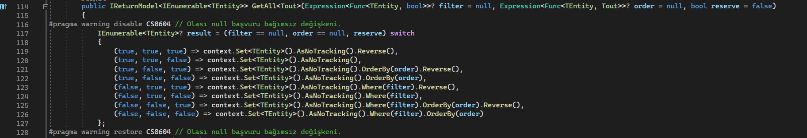
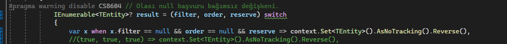

# Switch Case

`Switch-Case` ile kullaným anlatýmý ypamayacam bazý genel dýþý teknikleri yazacaðým<br>

* [When](###when-sarti)
* [Goto](###goto)
* [Switch Experssions](###switch-experssions)


### When sarti

```
switch (fiyat){

	case 100 when .......: break;

}
```

when koþuluda saðlanýyorsa çalýþýr.<br>


### Goto
Turkay Hocam cok pek sevmez :) <br>
caseler arasý atlamayý saðlar<br>

```
switch (fiyatBilgisi){

	case 100: goto case 200; //Console.WriteLine("300'den küçük"); break;
	case 200: Console.WriteLine("300'den küçük"); break;
	case 300: Console.WriteLine("300"); break;
	case 400: Console.WriteLine("300'den büyük"); break;
	case 500: goto case 400;  //Console.WriteLine("300'den büyük"); break;
}
```

þimdi saçma oldu ama mantýk þý sayý 300 ise 300 yada duruma göre çýktý veren switch yapýsý var diyelim
ben 400 veya 500 de ayný þeyi yazacaksam. yakýn olan 400 e durumu yazarým 500 de erim ki 400 e git. bu sayede az ve öz kod yazarým. 
buradaki goto farklý biraz ama programlamada direk goto kullanmak harbiden sýkýntýlý.


### Switch Experssions

string mesaj = ""

```
switch(günler)
{
	case 0: mesaj = "pazartesi"; break;
	case 1: mesaj = "salý"; break;
	case 2: mesaj = "çarþamba"; break;
	case 3: mesaj = "perþembe"; break;
	case 4: mesaj = "cuma"; break;
	case 5: mesaj = "cumartesi"; break;
	case 6: mesaj = "pazar"; break;
}
```

bu kullanýmý `expressions` ile 

```
switch(günler)
{
	0 => "pazartesi"; 
	1 => "salý";
	2 => "çarþamba";
	3 => "perþembe";
	4 => "cuma";
	5 => "cumartesi";
	6 => "pazar";
}
```

buna dönüþtürür ve gereksiz breakler case sýnýrlamalarý kalkar ama yine ayný satýr sayýsýnda kod diyorsanýz. Fazladan yazýlan gereksiz brekleri görmüyorsanýz size baþka projede yazdýðým kodu göstermek isterim. bu kodu ne if else nede normal switch bu kadar kýsa yazamazdý. tek satýr if belki yapardý ama okunurluk 0 olurdu.

```
        public IReturnModel<IEnumerable<TEntity>> GetAll<Tout>(Expression<Func<TEntity, bool>>? filter = null, Expression<Func<TEntity, Tout>>? order = null, bool reserve = false)
        {
#pragma warning disable CS8604 // Olasý null baþvuru baðýmsýz deðiþkeni.
            IEnumerable<TEntity>? result = (filter == null, order == null, reserve) switch
            {
                (true, true, true) => context.Set<TEntity>().AsNoTracking().Reverse(),
                (true, true, false) => context.Set<TEntity>().AsNoTracking(),
                (true, false, true) => context.Set<TEntity>().AsNoTracking().OrderBy(order).Reverse(),
                (true, false, false) => context.Set<TEntity>().AsNoTracking().OrderBy(order),
                (false, true, true) => context.Set<TEntity>().AsNoTracking().Where(filter).Reverse(),
                (false, true, false) => context.Set<TEntity>().AsNoTracking().Where(filter),
                (false, false, true) => context.Set<TEntity>().AsNoTracking().Where(filter).OrderBy(order).Reverse(),
                (false, false, false) => context.Set<TEntity>().AsNoTracking().Where(filter).OrderBy(order)
            };
#pragma warning restore CS8604 // Olasý null baþvuru baðýmsýz deðiþkeni.
```

When komutu burada da çalýþýr




okunurluk için aþaðýdaki gibi yapýlýr mý yapýlýr ama kod aþýrý uzar bu sebep ile aklýnýzda olsun




```
public class Student
{
    public string name;
    public string surname;
    public string alan;
}

Student student = new Student() { name = "Taha", surname = "Mücasiroðlu", alan = "Sayýsal" };
string anadersi = student switch
{
    { alan: "Sayýsal" } => "Matematik",
    { alan: "Sözel" } => "Tükçe",
    { alan: "Eþit-Aðýrlýk" } => "Matematik ve Türkçe"
};
```

üstteki kodda ise bir sýnýf içinde yer alan deðiþkenlere göre nasýl geri dönüþ ayarlancaðý gösterilmekte bu kullanýmda deðiþken oldu ama get ve setlerle oynanarak fonsiyon sonuçlarý ile bile atama yapýlýr baya genelleþtirici bir þey


