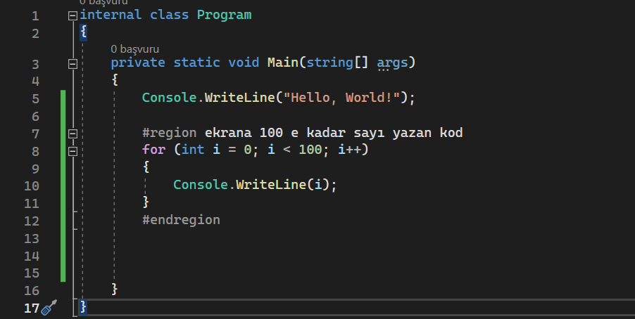
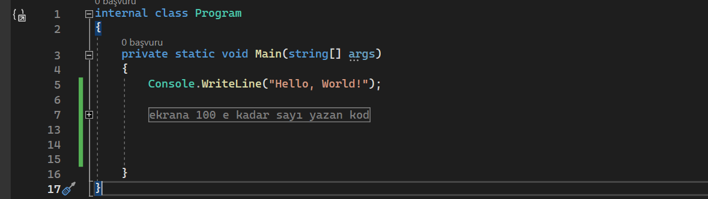
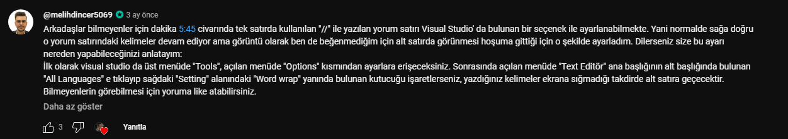

# Yorum Satýrlarý ve Region

`//` -> tak satýr yorum satýrý
`/*` çok satýrlý yorum  `*/` -> çok satýrlý yorum satýrý için
`Region` -> kod dosyalarýný katogorize etmek için kullanýlan ön iþlmeci kodudur.

`#region` **Baþlýk**
	**Kodlar**
`#endregion`

Örneðin:

Aralarýndaki farktan kod kýsalýðý ve anlaþýlýrlýðýný anlamýþsýnýzdýr.

Þeklinde kullanýlýr. Ne iþe yarar dersek;
1-) Belirli aralýktaki kodlarý gruplayarak ve baþlýk vererek, o kodlarýn daha rahat anlaþýlmasý saðlanýr.
2-) Çok satýrlý dosyalarýn önizlemesi kolaylaþýr.
3-) Çok kullanýlmaz muhtemelen ama arama yaparken bulmak için ek anahtar kelime olur.

Ek bilgi 1:
Youtube yorumunda gördüm bence gereksiz ama iþe yarayabilir.

