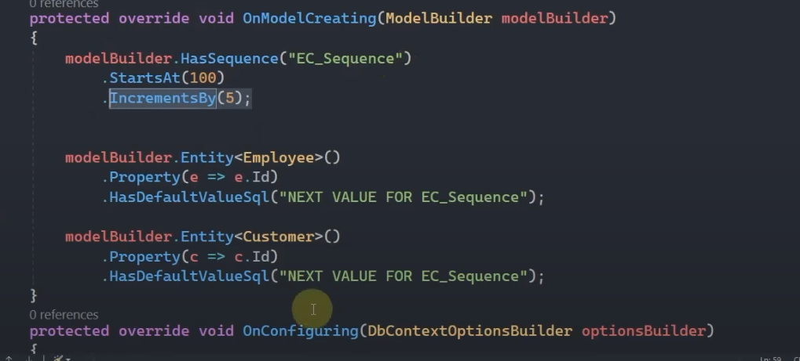

# EF Core

* [Db First](###dbfirst)
* [Code First](###codefirst)
* [Query Tags](###query-tags)
* [Global Query Filters](###global-query-filters)
* [IQuesyable ve IEnumerable](###iquesyable-ve-ienumerable)
* [Deferrend Execution](###deferrend-execution)
* [Sorgular](###sorgular)
* [Sorgu Kalitesi](###sorgu-kalitesi)
* [ExecuteUpdate ve ExecuteDelete Ýþlemleri](###executeupdate-ve-executedelete)
* [Kayýt alma](###kayit-alma)
* [Configs](###configs)
* [Eager Loading](###eager-loading)
* [Configleri Ayrý Kaydetme](###configleri-ayri-kaydetme)
* [Kalýtýmsal Durumlar](###kalitimsal-durumlar)
* [Karýþýk Notlar](###karisik-notlar)

### DbFirst

`DbFirst` demek var olan veritabanýna proje üretmeye veya projede önce veritabanýný inþaa etme yaklaþýmýna denir. <br>
`DbFirst` yaklýþýmýnda veritabanýný ef core ile projeye dahil etmek için database kýsmýnda <br> 
`dotnet ef dbcontext scaffold 'Server=(localdb)\MSSQLLocalDB; Database=Northwind; Trusted_Connection=True;' Microsoft.EntityFrameworkCore.SqlServer` 
<br>
denklemi için `dotnet ef dbcontext scaffold 'Server=[vreitabanýnýnýn olduðu yerin adý]; Database=[veritabaný adý]; [baðlantý durumu direk güven veya id þifre verilebilir];' [veritabaný paketi]`
<br>
sonrasýnda ise resimdeki gibi tabloalr dahil olur.


### CodeFirst

`CodeFirst` için yazmayacam çünkü **BANA GÖRE** var olan veritabanýna proje yapýlmadýkça kullanýlmamalý. Sebebi ise tipleme ve ayarlamalarýn hem `ssms`'da daha kolay olmasý hemde katmanlama için. Yani veritabaný ile sorunlu ekip veritabaný için üretilmiþ geliþtirme ortamýnda geliþtirme yapsýn. `Efcore` yerine dapper kullanasým gelse veritabancýlar ne yapacak acaba `codefirst`'te :D.


### Query Tags 

`Ef Core` ile generate edilen sorgulara açýklama eklememizi saðlayan özelliktir.<br>
`await context.Persons.ToListAsync()` <br>
loglamalarda bu sorgu yanýnda açýklama görmek isterseniz.<br>
`await context.Persons.TagWith("açýklama").ToListAsync()` <br>
yada <br>
`await context.Persons.TagWith("açýklama1").TagWith("açýklama2").ToListAsync()` <br>
yada <br>
`await context.Persons.TagWith("açýklama1").Where(p => p.Id > 5).TagWith("açýklama2").ToListAsync()` <br>


### Global Query Filters

Çoklu yerde kullanmayý saðlayan global `filtre`'ler kullanmayý saðlar.<br>
`Entitiy`'lerin ayarlamalarýnýn yapýldýðý kýsýmda tanýmlanýr.<br>
`modelBuilder.Entity<Person>().HasQueryFilter(p => p.IsAlive)`<br>
yukarýdaki örnekte global filtre tanýmlayarak artýk her insan tablosu sorgulandýðýnda `IsAlive` deðeri `true` olanlarda arama yapcak. <br>
eðer bunu sonradan kullanmadan sorgulamak istersek.<br>
`context.Persons.IgnoreQueryFilters().methodlar..`<br>
þelinde ön tanýmlý filtreleri iptal edebilirsiinz.

### IQuesyable ve IEnumerable
`IQueryable` sorguya karþýlýk gelir. Efcore üzerinde yapýlmýþ sorgunun execute edilmemiþ hali demektir.
<br>
`IEnumerable` ise execute edilmiþ memorydeki halidir.

### Deferrend Execution 
yaptýðýn sorgularda parametre deðerleri sonradan deðiþirse ve sen sorguyu sonradan execute edersen güncel parametreye göre sorgu çeker. örneðin


burada id yi 5 ten büyük deðil 200 den biyik olanlarý getirir.

### Sorgular

`ThenBy` -> orderby sorgusunu çoðaltmak için kullanýlýr.<br>
`OrderByDescending` -> orderby in tersi büyükten küçüðe yani<br>
`ThenByDescending` -> ek olarak tersine sorgula<br>
`Any` -> sorgu sonucu veri geliyor mu gelmiyor mu <br>
`All` -> tüm veriler þarta uyarsa true döner aksi halde false<br>
`GroupBy` -> gruplar adý üzerinde verilen duruma göre gruplar<br>

### Change Tracker

`SaveChangesAsync(false)` þeklinde kullanýmda kaydedilen verilerin takibi devam eder.


### Sorgu Kalitesi

#### 1
`IQueryable` ile `IEnumerable` ayrýmýnýn yapýlmasý
<br>
Eðer `IEnumarable` ile yapmak istersen `context.Entity.AsEnumarable().methodlar` þeklinde ilerlenir.
<br>
tercih `IQueryable`

#### 2
`Select` methodu ile gerekli kolonu getirerek maliyeti azaltabilirisin.
<br>


#### 3
`result`'ý limitle. tablodaki verileri alýrken limitleyin.<br>
`context.Persons.ToList()` yerine<br>
`context.Persons.Take(sayý).ToList()` ile daha saðlýklý iþ olur. tabloda bilyonlarca veri varsa hepsini çekmeye gerek yok.
<br>

#### 4
`asenkron yani async` tercih edin.

### ExecuteUpdate ve ExecuteDelete

bunlar sayesinde toplu güncelleme ve silmede kolaylýk ve performans geldi. efcore 7 özelliði


### Kayit Alma
[Burada](https://learn.microsoft.com/tr-tr/ef/core/performance/performance-diagnosis?tabs=simple-logging%2Cload-entities) Burada anlatýlana göre eðer sorgularý kontrol etmek isterseniz yani program sýrasýnda veritabanýna gönderilen sorgularý kontrol etmek isterseniz. <br>

```
protected override void OnConfiguring(DbContextOptionsBuilder optionsBuilder)
{
    optionsBuilder
        .UseSqlServer(@"Server=(localdb)\mssqllocaldb;Database=Blogging;Trusted_Connection=True")
        .LogTo(Console.WriteLine, LogLevel.Information);
}
```
þekline `.LogTo` methodundan yararlanabilirsiniz. bu `Konsol`'a info ve üstü bilgileri basar. [`Query Tags`](###query-tags) kullanarakta bunlara bilgi gömebilirisiniz. 


### Configs


modelBuilder.Model.GetEntityTypes(); ile entitlerin tiplerini liste halinde alabilirisn<br>

`ToTable` -> üretilecek tablonun adýný belirler <br>

`HasColumnName` - `HasColumnType` - `HasColumnOrder` -> ile kolon isim tip ve sýra ayarlamasý yapabilirisin. <br>

`ForeignKey` -> tabloda baþka tablo adý + Id varsa kendi oto ayarlar ama manuel istersen bununla baðlantý ismini tanýmlarsýn.
```
modelBuilder.Entity<Person>()
    .HasOne(p => p.Department)
    .WithMany(d => d.Persons)
    .HasForeignKey(p => p.Id);
```
þeklinde tanýmlama ile tanýmlanabilir.
<br>

`Ignore` -> Tüm propertyler kolon olarak eklenir. bazen property lazým olur ama tabloya koymayacaksýn o zaman bunu kullanýrsýn. ` entity<person>().ýgnore(p=>p.asdasd) ` <br>

`HasKey` -> Efcore da default olarak Id tanýmlýlar key oalrak tanýmlanýýr. bunu kendi istediðini vermek için Key kulanýlýr. eðer tabloda primary key yoksa hata verir. 

`IsRowVersion` -> versiyon tutar. byte[] tipimnde tutulur. `entity<person>().property(p=>p.asdasd).IsRowVersion();` <br>

`IsRequired` -> deðerin girilmesini zorunlu olduðunu ifade eder. <br>

`HasMaxLength` -> string deðerlerin uzunluðunu belirtir. property sonrasý kullanýlýr.<br>

`HasPrecision(5,3)` -> sayýlarýn virgül öncesi ve sonrasý uzunluklarýný belirler. <br>

`IsUnicode` -> kolon içerisinde unicode karakter varsa kullanýlýr.<br>

`HasComment` -> kolonlara açýklamalar ekler.<br>

`IsConcurrencyToken` -> verinin bütünlüðünü kontrol eder. `Property` sonrasý kullanýlýr.<br>

`Composite key` -> tabloda birden fazla kolon `primarykey` yapýlmak istenirse kullanýlýr. `entity<person>.HasKey(key1,key2,key3)` verilir. <br>

`HasDefaultSchema` -> `[dbo]` þeklinde olan default þemalarý ezmeyi saðlar. <br>

`HasDefaultValue` -> `property` sonrasý kullanýlýr. property e default value atanýr. <br>

`HasDefaultValueSql` -> `property` sonrasý kullanýlýr. property e default value atanýr. deðer sql olarak atanýr. sql de atanýr yani tarih için datetime  deðil getdate() olur. sadece bu deðil bu arada direk sql komutuda olur. sadece fonsiyon olarak vermen lazým.<br>

`HasComputedColumnSql` -> birden fazla kolonu belirli hesaplamalar ile tek kolona baðlama diyebiliriz. name ve surname i full name ile kolona yazdýrma gibi düþün. tabi bu ýgnore bir property ile yapmak daha iyi db den bir property az çekilir bve tutulur ek performans<br>

`HasConstraintName` -> constraint isimlerini baskýlar. foreing key isimlerini filan ayarlarsýn <br>

`HasData` -> seed lemede kullanýlýr. hazýr veri hazýrlar.<br>

`HasDiscriminator` -> entityler arasý kalýtýmda kullanýlýr. miras alan tiplerin ayrýmýnda kullanýlýr default olarak string türünde isimleri tutar sonrasýnda has value ile tiplere özel deðer atarsýn.<br>

`HasNoKey` ->  primarykey kolonu olmak zorunda ama yoksa bunu belirtmelisin bununla yoksa hata alýrýsýn.<br>

`HasQueryFilter` ->  bununla sorgularýn hepsinde uygulanacak sorgu eklenir mesela silindimi diye bir deðerde false getirmek istersen burada belirtirsin baþka yerde uygulamazsýn. Burada verip üstüne sorguda bir daha yazarsan performans kaybý olunur. <br>

`Identity` -> otomatik artan demektir. bir tabloda tek bir tane olabilir. bir kolon olabilir.

`HasIndex()` -> sorgularda performans arttýrýmý saðlar. FK, PK ve AK olan kolonlar otomatik indexlenir.(index aramalarda kullanacaðýný belirterek o kolonun arama için optimize olmasýný saðlýyor diye anladým.) farklý kolona index atamak için `entitiy<T>().HasIndex(x => new {x.asdasd, x.asdasd, x.asdasd,....})`  sonuna `.IsUnique()` koyarsan benzersiz dersin ve performansý arttýrýrsýn. `HasFilter()` kullanýrsan sonuna indexlemede filtreleme yapar. ayrýca sona `IncludeProperties` ile ilerde sorgulamada kullanabileceðin verileri söylersen bunlarýda tyabloya yandan ekler ve ilerde kullandýðýnda boþ yere maliyeti yükseltmez <br>

`HasSequence` -> Identity gibi veri atar ama sürekli artandan ziyade ayarlanabilir. Fakat Db ler için farklý tanýmlanýr dikkat ediþlmeli. <br>

sequence veritabanýna baðlý identity ise tabloya baðlý. identity diskten veri alýrken sequence ramden alýr daha hýzlýdýr. sequence tablo dýþý olduðu için ayný sequence farklý yerde kullanýlabilir.

### Eager Loading

sorgunun iliþkisel diðer tablolardan eklenmesine `èager loading` denir. 


### Configleri Ayri Kaydetme

Entityler de ayar uygulamamýzý saðlayan sýnýf olan `IEntityTypeConfiguration<T>` ile ayrý yerde ayarlamalarý yaparak `modelbuilder` kýsmýný þiþirmeyiz.

### Kalitimsal Durumlar

entitylerin birbirinden miras almasý veya baþka yerlerden miras almasý mesela her tabloda Id varsa bunu Entity sýnýfýndan biras veririz her yere.

#### TPH Table Per Hierarchy

tablo baþýna hiyerarþi demek. Burada kalýtým ile birbirine baðlý entitiler tek bir tabloda birleþtirilir. Ayrýmlarý için `Discriminator` kullanýlýr.


#### TPT Table Per Type

her entity için tablo oluþturur ve üst sýnýfý ile birebir iliþki oluþturur.
`TPH` ile ayný yapýya sahip farký `modelbuilder` içinde tablolara aynýda olsa `totable` ile isim vermek
`modelbilder.entity<(Abstract olan entity)>().UseTptMappingStrategy()` de varmýþ ama denemek lazým


#### TPC Table Per Concrete Type

Ef Core 7 de geldi. Soyut türlere tablo üretmez. Abstractlara tablo oluþturmaz yani. Fakat abstract tabloda bulunan elemanlarý somutlarýn hepsine ekler.
bunda ise `TPT`'den daha kolay þekilde `modelbilder.entity<(Abstract olan entity)>().UseTcpMappingStrategy()`


### Karisik Notlar
``` 
kendime not yorum ekle böyle
protected override void OnModelCreating(ModelBuilder modelBuilder)
{
    modelBuilder.Entity<Blog>()
        .Property(b => b.Url)
        .HasComment("The URL of the blog");
}


start date gibi þeyleri hasvalue ile yap

protected override void OnModelCreating(ModelBuilder modelBuilder)
{
    modelBuilder.Entity<Blog>()
        .Property(b => b.Created)
        .HasDefaultValueSql("getdate()");
}

protected override void OnModelCreating(ModelBuilder modelBuilder)
{
    modelBuilder.Entity<Blog>()
        .Property(b => b.Rating)
        .HasDefaultValue(3);
}


hazýrda belli verileri birleþtirerek tutmak 

modelBuilder.Entity<Person>()
    .Property(p => p.DisplayName)
    .HasComputedColumnSql("[LastName] + ', ' + [FirstName]");

```

* entitylerde aðlarý ile ekleme yaparken kullanabilmek için ctor ile baþlangýçta alma yapýlablir.

* entitylerde get setleerde field özelliðini deðiþtirebilirsin

* field and property access -> filed yada propertyleri kullanýp kullanmamasýný ayarlayabileceðimiz özelliktir. 

* shadow property -> db de olan kolonu entity içinde tanýmlamamadýr. mesela createDate sabit olacaðý için entityde konulmaz.


