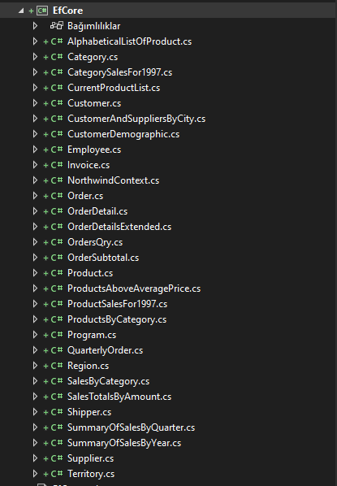
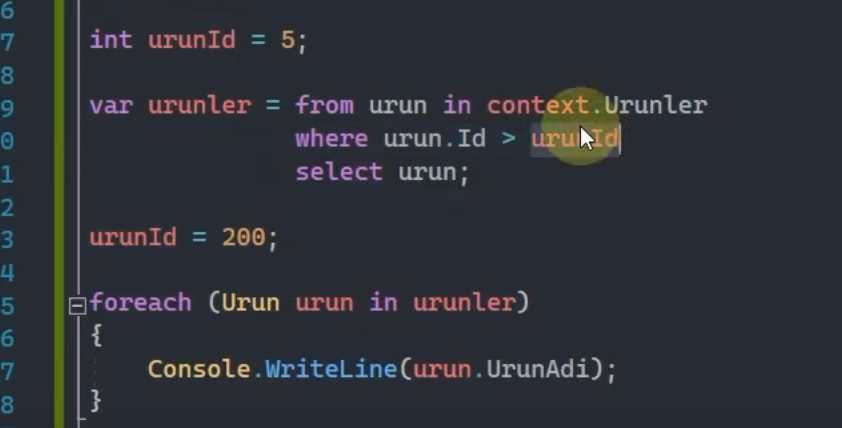

# EF Core

* [Db First](###dbfirst)
* [Code First](###codefirst)
* [Query Tags](###query-tags)
* [Global Query Filters](###global-query-filters)
* [IQuesyable ve IEnumerable](###iquesyable-ve-ienumerable)
* [Deferrend Execution](###deferrend-execution)
* [Sorgular](###sorgular)
* [Sorgu Kalitesi](###sorgu-kalitesi)
* [ExecuteUpdate ve ExecuteDelete Ýþlemleri](###executeupdate-ve-executedelete)
* [Kayýt alma](###kayit-alma)


### DbFirst

`DbFirst` demek var olan veritabanýna proje üretmeye veya projede önce veritabanýný inþaa etme yaklaþýmýna denir. <br>
`DbFirst` yaklýþýmýnda veritabanýný ef core ile projeye dahil etmek için database kýsmýnda <br> 
`dotnet ef dbcontext scaffold 'Server=(localdb)\MSSQLLocalDB; Database=Northwind; Trusted_Connection=True;' Microsoft.EntityFrameworkCore.SqlServer` 
<br>
denklemi için `dotnet ef dbcontext scaffold 'Server=[vreitabanýnýnýn olduðu yerin adý]; Database=[veritabaný adý]; [baðlantý durumu direk güven veya id þifre verilebilir];' [veritabaný paketi]`
<br>
sonrasýnda ise resimdeki gibi tabloalr dahil olur.


### CodeFirst

`CodeFirst` için yazmayacam çünkü **BANA GÖRE** var olan veritabanýna proje yapýlmadýkça kullanýlmamalý. Sebebi ise tipleme ve ayarlamalarýn hem `ssms`'da daha kolay olmasý hemde katmanlama için. Yani veritabaný ile sorunlu ekip veritabaný için üretilmiþ geliþtirme ortamýnda geliþtirme yapsýn. `Efcore` yerine dapper kullanasým gelse veritabancýlar ne yapacak acaba `codefirst`'te :D.


### Query Tags 

`Ef Core` ile generate edilen sorgulara açýklama eklememizi saðlayan özelliktir.<br>
`await context.Persons.ToListAsync()` <br>
loglamalarda bu sorgu yanýnda açýklama görmek isterseniz.<br>
`await context.Persons.TagWith("açýklama").ToListAsync()` <br>
yada <br>
`await context.Persons.TagWith("açýklama1").TagWith("açýklama2").ToListAsync()` <br>
yada <br>
`await context.Persons.TagWith("açýklama1").Where(p => p.Id > 5).TagWith("açýklama2").ToListAsync()` <br>


### Global Query Filters

Çoklu yerde kullanmayý saðlayan global `filtre`'ler kullanmayý saðlar.<br>
`Entitiy`'lerin ayarlamalarýnýn yapýldýðý kýsýmda tanýmlanýr.<br>
`modelBuilder.Entity<Person>().HasQueryFilter(p => p.IsAlive)`<br>
yukarýdaki örnekte global filtre tanýmlayarak artýk her insan tablosu sorgulandýðýnda `IsAlive` deðeri `true` olanlarda arama yapcak. <br>
eðer bunu sonradan kullanmadan sorgulamak istersek.<br>
`context.Persons.IgnoreQueryFilters().methodlar..`<br>
þelinde ön tanýmlý filtreleri iptal edebilirsiinz.

### IQuesyable ve IEnumerable
`IQueryable` sorguya karþýlýk gelir. Efcore üzerinde yapýlmýþ sorgunun execute edilmemiþ hali demektir.
<br>
`IEnumerable` ise execute edilmiþ memorydeki halidir.

### Deferrend Execution 
yaptýðýn sorgularda parametre deðerleri sonradan deðiþirse ve sen sorguyu sonradan execute edersen güncel parametreye göre sorgu çeker. örneðin



burada id yi 5 ten büyük deðil 200 den biyik olanlarý getirir.

### Sorgular

`ThenBy` -> orderby sorgusunu çoðaltmak için kullanýlýr.<br>
`OrderByDescending` -> orderby in tersi büyükten küçüðe yani<br>
`ThenByDescending` -> ek olarak tersine sorgula<br>
`Any` -> sorgu sonucu veri geliyor mu gelmiyor mu <br>
`All` -> tüm veriler þarta uyarsa true döner aksi halde false<br>
`GroupBy` -> gruplar adý üzerinde verilen duruma göre gruplar<br>

### Change Tracker

`SaveChangesAsync(false)` þeklinde kullanýmda kaydedilen verilerin takibi devam eder.


### Sorgu Kalitesi

#### 1
`IQueryable` ile `IEnumerable` ayrýmýnýn yapýlmasý
<br>
Eðer `IEnumarable` ile yapmak istersen `context.Entity.AsEnumarable().methodlar` þeklinde ilerlenir.
<br>
tercih `IQueryable`

#### 2
`Select` methodu ile gerekli kolonu getirerek maliyeti azaltabilirisin.
<br>


#### 3
`result`'ý limitle. tablodaki verileri alýrken limitleyin.<br>
`context.Persons.ToList()` yerine<br>
`context.Persons.Take(sayý).ToList()` ile daha saðlýklý iþ olur. tabloda bilyonlarca veri varsa hepsini çekmeye gerek yok.
<br>

#### 4
`asenkron yani async` tercih edin.

### ExecuteUpdate ve ExecuteDelete

bunlar sayesinde toplu güncelleme ve silmede kolaylýk ve performans geldi. efcore 7 özelliði


### Kayit Alma
[Burada](https://learn.microsoft.com/tr-tr/ef/core/performance/performance-diagnosis?tabs=simple-logging%2Cload-entities) Burada anlatýlana göre eðer sorgularý kontrol etmek isterseniz yani program sýrasýnda veritabanýna gönderilen sorgularý kontrol etmek isterseniz. <br>

```
protected override void OnConfiguring(DbContextOptionsBuilder optionsBuilder)
{
    optionsBuilder
        .UseSqlServer(@"Server=(localdb)\mssqllocaldb;Database=Blogging;Trusted_Connection=True")
        .LogTo(Console.WriteLine, LogLevel.Information);
}
```
þekline `.LogTo` methodundan yararlanabilirsiniz. bu `Konsol`'a info ve üstü bilgileri basar. [`Query Tags`](###query-tags) kullanarakta bunlara bilgi gömebilirisiniz. 


``` 
kendime not yorum ekle böyle
protected override void OnModelCreating(ModelBuilder modelBuilder)
{
    modelBuilder.Entity<Blog>()
        .Property(b => b.Url)
        .HasComment("The URL of the blog");
}


start date gibi þeyleri hasvalue ile yap

protected override void OnModelCreating(ModelBuilder modelBuilder)
{
    modelBuilder.Entity<Blog>()
        .Property(b => b.Created)
        .HasDefaultValueSql("getdate()");
}

protected override void OnModelCreating(ModelBuilder modelBuilder)
{
    modelBuilder.Entity<Blog>()
        .Property(b => b.Rating)
        .HasDefaultValue(3);
}


hazýrda belli verileri birleþtirerek tutmak 
modelBuilder.Entity<Person>()
    .Property(p => p.DisplayName)
    .HasComputedColumnSql("[LastName] + ', ' + [FirstName]");


```


