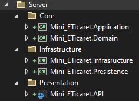

# [Buradaki](https://www.youtube.com/watch?v=th__PLvBxZI&list=PLQVXoXFVVtp1DFmoTL4cPTWEWiqndKexZ) Eðitim notudur.

# E-Ticaret sitesi c# api ve Angular var ama Angularý ile Þuan Uðraþmam Api Kýsmýna Bakacaðým. 

### Backend

`Onion Architecture` kullanarak geliþtirilecek. Daha az baðýmlýlýk saðlayacak.

 

Öncelikle Proje Dosyalarýný resimdeki gibi hazýrladýk.

Þimdi projelerin referanslarýný yani eriþimlerini ayarlamamýz gerekiyor.

artýk proje referanslarýda eklendi

 

Projeyi sildim. Angular olduðu için sadece biraz baþýný izleyip bilgi almaya karar verdim. Angular þuan ihtiyaç dýðý o yüzden bu proje çok kaliteli olmasýna raðmen bende fazla olacak.
O yüzden ilerde ya burayý güncellerim ilerde yada yeni repoda notlarý atarým

 

### Generic Repository Design Pattern

birden fazla veritabaný kullanýmýnda `Generic Repository Design Pattern` yaklaþýmýný kullanmalýyýz. `Generic Repository Design Pattern` yaklaþýmýnda `genericler` ve `interfaceler` aracýlýðý ile istenilen durumlarý ayýrýrýz. Ne demek istedim. Temelden alýrsak yazma ve okuma iþlemlerini ayýrarak yazma iþlemlerini `EfCore` ile okuma iþlemlerini `dapper` ile yapabilirsin. Ne iþime yarar dersen biraz daha hýz katabilir.
 
bu sadece okuma ve yazma olarak deðil. Örnek veriyorum `loglarý` `ADO.NET` ile kaydedersin. Bunu yapmak zorunda deðilsin ama bunlarý yapmaya temel hazýrlamak zorundasýn bana göre.
 
Eðer takip istemiyorsan `AsNoTracking()` kullanýlýr. Bu bence api projelerinde `default` olarak `AsNoTracking()` olmalý.
 

